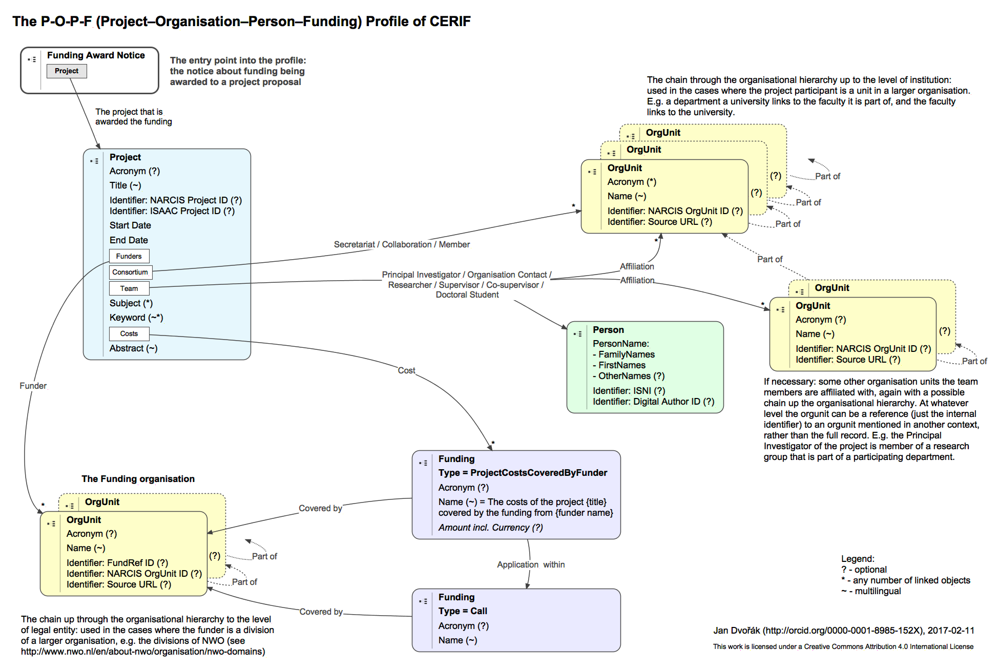

# The POP CERIF profile for funding award notices

[jan.dvorak@ff.cuni.cz](mailto:jan.dvorak@ff.cuni.cz)

## The grand picture

The funding organisation evaluates research project proposals it received and takes a decision on which projects to fund.
Those lucky ones will be communicated to the proposing organisations in a structured way – of course we mean [CERIF](http://eurocris.org/cerif/main-features-cerif) here.

Why does one need to communicate the whole project data?
Wouldn't it – in an ideal world – suffice to mention an identifier of the proposal?
(Your proposal was assigned an identifier when it was submitted, right?)

No, just sending a flag information wouldn't do.
A project proposal may undergo adjustments of the funding, timelines, consortium/team members, work plan, ..., or even the title.
Such adjustments typically result from a negotiation process between the funder and the proposing consortium.
It is of vital importance that the funder communicates their idea of the project for the consortium to validate before a contract is done.

For this purpose there is the *funding award letter* or *notice*.
The administrative communication between human actors 
is best *amended* with sending machine-processable information 
along with the letter or through a previously negotiated communication channel.

In essence, the funder's CRIS shall communicate the current project outline to the proposing institutions' CRISses.
The actual mechanism of communication is left aside here, we concentrate on the scope, arrangement and format of the communicated information.

## The CERIF profile

A CERIF profile is a specialization of the general CERIF to the needs of a particular research information interchange.
Typically this means that:
* some (usually many) CERIF entities are left out;
* some attributes of the remaining entities may be also marked as not used;
* concrete semantic vocabularies are picked up to classify the types, statuses and subjects of the relevant entities, as well as relationship types (roles) between objects;
* business rules are added to the mix.

The [POP profile schema](./schemas/p-o-p-profile-schema.xsd) defines the `FundingAwardNotice` element in the `urn:xmlns:nl:pop-project:cerif-profile-1.0-EXPERIMENTAL` namespace.
That element shall be used as the top element of the funding award notices.
It can be a root element in stand-alone POP CERIF documents, or it can be embedded in a communication protocol (think of an OAI-PMH response).

The syntax of the file shall be easy to understand from the schema and the examples provided.
The following diagram should give you an overview:

You will see the different CERIF entities. OrgUnits are in fact used in three different contexts here:
* as the funding agency,
* as the consortium member,
* as an orgunit a project team member is affiliated with.

## Examples

We have provided 22 sample files with data from the [NARCIS](http://www.narcis.nl/) portal:
* 10 sample files where Radbout University is the secretariat:
[sample-RU01-OND1359606.xml](sample-RU01-OND1359606.xml), 
[sample-RU02-OND1359644.xml](sample-RU02-OND1359644.xml), 
[sample-RU03-OND1359670.xml](sample-RU03-OND1359670.xml), 
[sample-RU04-OND1359693.xml](sample-RU04-OND1359693.xml), 
[sample-RU05-OND1359849.xml](sample-RU05-OND1359849.xml), 
[sample-RU06-OND1359943.xml](sample-RU06-OND1359943.xml), 
[sample-RU07-OND1359972.xml](sample-RU07-OND1359972.xml), 
[sample-RU08-OND1360000.xml](sample-RU08-OND1360000.xml), 
[sample-RU09-OND1360015.xml](sample-RU09-OND1360015.xml), 
[sample-RU10-OND1360043.xml](sample-RU10-OND1360043.xml);
* 10 sample files where Utrecht University is the secretariat:
[sample-UU01-OND1359846.xml](sample-UU01-OND1359846.xml), 
[sample-UU02-OND1359878.xml](sample-UU02-OND1359878.xml), 
[sample-UU03-OND1359924.xml](sample-UU03-OND1359924.xml), 
[sample-UU04-OND1359931.xml](sample-UU04-OND1359931.xml), 
[sample-UU05-OND1359933.xml](sample-UU05-OND1359933.xml), 
[sample-UU06-OND1359957.xml](sample-UU06-OND1359957.xml), 
[sample-UU07-OND1359965.xml](sample-UU07-OND1359965.xml), 
[sample-UU08-OND1360014.xml](sample-UU08-OND1360014.xml), 
[sample-UU09-OND1360038.xml](sample-UU09-OND1360038.xml), 
[sample-UU10-OND1360133.xml](sample-UU10-OND1360133.xml), and
* 2 sample files where information about the funding round has been matched and added in the files:
[sample-UU11-OND1353009-with-call-info.xml](sample-UU11-OND1353009-with-call-info.xml), 
[sample-UU12-OND1353032-with-call-info.xml](sample-UU12-OND1353032-with-call-info.xml).

All the projects should be reasonably recent.
Of course the examples are valid with respect to the schema.

## Usage notes 

### Usage notes for consumers of the POP CERIF information

The project information is probably useful to insert in your institution's CRIS in any case, 
whether you do have the project proposal stored in the CRIS or not.
If the proposal is matched, it shall be linked with the funded project record.

The persons and orgunits shall be matched. 
For your staff and organisational structure, you are holding the master data already, so don't update.
For other instutions' staff and orgunits, you may choose to update the information you are having, but you should probably be careful.

Of course, you should only accept valid information.

### Usage notes for producers of the POP CERIF information

Include as many identifiers in the information as you can reliably provide. 
That will make information matching easier at the institutions.
Take care to update your information on the organisational structure of the involved institutions – use the information from the project proposals, or (better yet), have an independent channel for following changes in the organisational structure of institutions you fund regularly.

Make sure you validate all information you produce. Monitor and try to resolve any issues you see or receive reports of.

### Usage notes for maintainers of the profiles

The profile is rather flexible, it allows extensions of the semantic vocabularies. 
Please keep the `urn:xmlns:nl:pop-project:vocab:` prefix for the types, roles, statuses.
If you need a new or updated discipline classification, make a specific XML Schema for that and `<xs:import>` it into the main schema (follow the example in the [Subject XML Schema](./schemas/subjects.xsd)).

